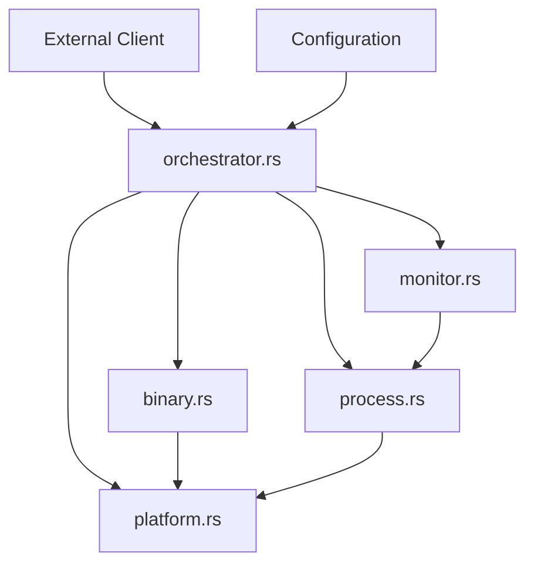
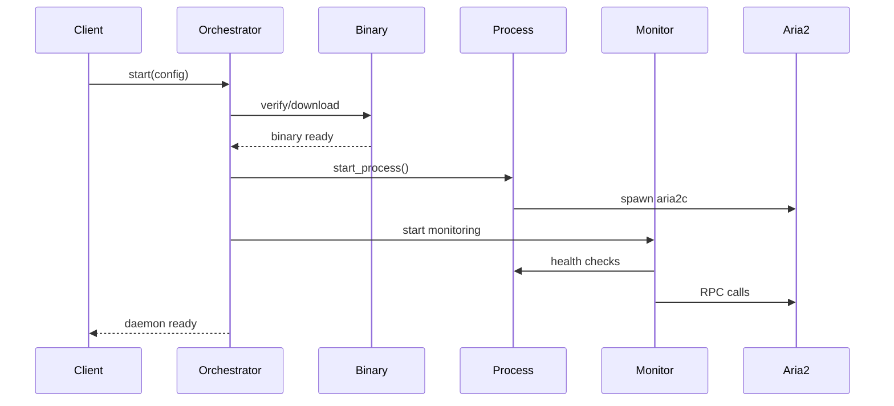

# Daemon Module Documentation

## 概述

daemon 模块是 burncloud-download-aria2 项目的核心组件，提供了完整的 aria2 守护进程管理系统。该模块实现了自动化的二进制文件管理、进程控制、健康监控和故障恢复功能。

## 模块架构

```
daemon/
├── binary.rs       - 二进制文件管理
├── process.rs      - 进程生命周期管理
├── monitor.rs      - 健康监控和自动恢复
├── orchestrator.rs - 主协调器
├── platform.rs     - 平台特定功能
└── mod.rs          - 模块声明
```

## 核心组件

### 1. [二进制文件管理 (binary.rs)](binary.md)

负责 aria2 二进制文件的自动下载、验证和安装：

- **主要功能**：
  - 验证二进制文件存在性
  - 多源下载（GitHub + Gitee 故障转移）
  - ZIP 文件解压和二进制提取
  - 平台特定的权限设置

- **关键特性**：
  - 异步下载和 I/O 操作
  - 故障转移机制确保高可用性
  - 跨平台兼容性

### 2. [进程管理 (process.rs)](process.md)

提供 aria2 进程的完整生命周期管理：

- **核心结构**：
  - `ProcessConfig` - 进程配置参数
  - `ProcessHandle` - 线程安全的进程控制器

- **主要功能**：
  - 进程启动和停止
  - 状态监控和查询
  - 重启计数管理
  - 线程安全的并发访问

- **配置特性**：
  - RPC 服务配置
  - 会话管理和断点续传
  - 调试模式支持

### 3. [健康监控 (monitor.rs)](monitor.md)

实现自动化的进程健康监控和故障恢复：

- **监控策略**：
  - 双重检查（进程 + RPC 服务）
  - 可配置的检查间隔
  - 智能重启机制

- **故障恢复**：
  - 指数退避算法
  - 重启次数限制
  - 优雅的故障处理

- **设计模式**：
  - 异步后台监控
  - 事件驱动的响应机制

### 4. [主协调器 (orchestrator.rs)](orchestrator.md)

系统的核心协调器，统一管理各个子组件：

- **配置管理**：
  - `DaemonConfig` - 全局配置结构
  - 合理的默认值设置
  - 灵活的配置覆盖

- **启动流程**：
  1. 二进制文件准备
  2. 目录创建和验证
  3. 进程启动和配置
  4. RPC 就绪等待
  5. 健康监控启动

- **生命周期管理**：
  - 优雅的启动和关闭
  - 自动资源清理
  - 异常处理和恢复

## 使用示例

### 基本使用

```rust
use std::sync::Arc;
use crate::daemon::{Aria2Daemon, DaemonConfig};
use crate::client::Aria2Client;

#[tokio::main]
async fn main() -> Result<(), Box<dyn std::error::Error>> {
    // 使用默认配置
    let config = DaemonConfig::default();

    // 创建客户端
    let client = Arc::new(Aria2Client::new(
        config.rpc_port,
        config.rpc_secret.clone(),
    ));

    // 启动守护进程
    let daemon = Aria2Daemon::start(config, client).await?;
    println!("Daemon started successfully");

    // 检查健康状态
    if daemon.is_healthy().await {
        println!("Daemon is running normally");
    }

    // 优雅关闭
    daemon.stop().await?;
    println!("Daemon stopped");

    Ok(())
}
```

### 自定义配置

```rust
use std::path::PathBuf;
use std::time::Duration;

let config = DaemonConfig {
    rpc_port: 8080,
    rpc_secret: "custom_secret".to_string(),
    download_dir: PathBuf::from("/custom/downloads"),
    session_file: PathBuf::from("/custom/aria2.session"),
    max_restart_attempts: 20,
    health_check_interval: Duration::from_secs(30),
};
```

## 架构设计

### 模块间依赖关系



### 数据流图



## 配置指南

### 开发环境配置

```rust
let config = DaemonConfig {
    rpc_port: 6800,
    health_check_interval: Duration::from_secs(5),  // 快速故障检测
    max_restart_attempts: 5,                        // 快速失败
    ..Default::default()
};
```

### 生产环境配置

```rust
let config = DaemonConfig {
    rpc_port: 16800,                               // 非标准端口
    rpc_secret: load_secure_secret(),              // 安全密钥
    download_dir: PathBuf::from("/var/lib/aria2"), // 系统目录
    max_restart_attempts: 30,                      // 高可用性
    health_check_interval: Duration::from_secs(60), // 资源优化
};
```

## 错误处理

daemon 模块使用统一的错误类型 `Aria2Error`，提供详细的错误分类：

- `BinaryDownloadFailed` - 二进制文件下载失败
- `ProcessStartFailed` - 进程启动失败
- `ProcessManagementError` - 进程管理错误
- `DaemonUnavailable` - 守护进程不可用
- `RestartLimitExceeded` - 超过重启限制

## 性能特性

### 异步设计
- 所有 I/O 操作都是异步的
- 支持高并发访问
- 非阻塞的网络和文件操作

### 资源管理
- 智能的内存使用
- 自动资源清理
- 最小化系统资源占用

### 故障恢复
- 自动检测和恢复
- 指数退避避免系统过载
- 灵活的重启策略

## 安全考虑

### RPC 安全
- 强制使用 RPC 密钥认证
- 可配置的网络端口
- 本地绑定的默认配置

### 文件系统安全
- 路径验证和清理
- 权限检查和设置
- 安全的临时文件处理

## 监控和诊断

### 日志记录
- Debug 构建时的详细日志
- 进程输出捕获
- 故障诊断信息

### 健康检查
- 多层次的健康验证
- 实时状态监控
- 自动故障检测

## 扩展性

daemon 模块设计为高度可扩展：

1. **配置扩展** - 轻松添加新的配置选项
2. **监控扩展** - 支持自定义健康检查逻辑
3. **平台扩展** - 添加新平台支持
4. **错误处理扩展** - 定制错误类型和处理

## 测试

建议的测试策略：

- **单元测试** - 各个模块的独立功能
- **集成测试** - 模块间的协作
- **端到端测试** - 完整的守护进程生命周期
- **故障测试** - 异常情况和恢复机制

## 贡献指南

在修改 daemon 模块时请注意：

1. 保持向后兼容性
2. 添加适当的错误处理
3. 更新相关文档
4. 确保线程安全
5. 遵循异步设计原则

## 相关文档

- [API Reference](../api/) - 完整的 API 文档
- [Configuration Guide](../config/) - 详细的配置指南
- [Troubleshooting](../troubleshooting/) - 常见问题解决