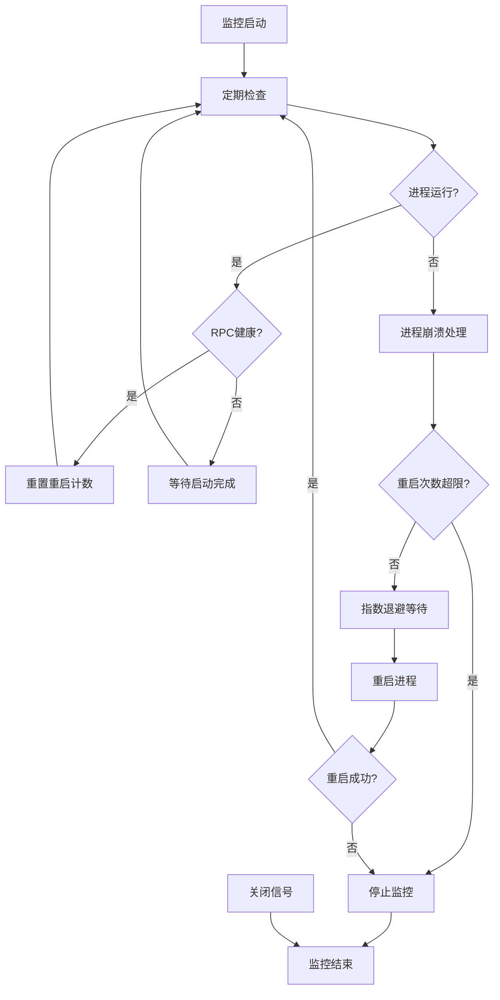

# Health Monitor Module (daemon/monitor.rs)

## 概述

`daemon/monitor.rs` 模块实现了 aria2 进程的健康监控系统。该模块负责定期检查进程状态和 RPC 服务的可用性，并在检测到故障时自动执行重启逻辑。健康监控器运行在独立的后台任务中，提供了自动化的故障恢复能力。

## 结构体定义

### HealthMonitor
```rust
pub struct HealthMonitor {
    process: Arc<ProcessHandle>,
    client: Arc<Aria2Client>,
    shutdown: Arc<Notify>,
    check_interval: Duration,
}
```

**作用**: aria2 进程的健康监控器

**字段说明**:
- `process: Arc<ProcessHandle>` - 被监控的进程句柄，支持多线程共享
- `client: Arc<Aria2Client>` - aria2 RPC 客户端，用于健康检查
- `shutdown: Arc<Notify>` - 关闭信号通知器，支持优雅停止
- `check_interval: Duration` - 健康检查间隔时间

**设计特点**:
- 使用 `Arc` 实现跨线程的安全共享
- 通过 `Notify` 提供异步的关闭机制
- 可配置的检查频率，平衡资源使用和响应速度

## 方法实现

### 构造方法

#### new
```rust
pub fn new(
    process: Arc<ProcessHandle>,
    client: Arc<Aria2Client>,
    check_interval: Duration,
) -> Self
```

**作用**: 创建新的健康监控器实例

**参数**:
- `process: Arc<ProcessHandle>` - 要监控的进程句柄
- `client: Arc<Aria2Client>` - aria2 RPC 客户端
- `check_interval: Duration` - 健康检查的时间间隔

**返回值**:
- `Self` - 新的 HealthMonitor 实例

**初始化**:
- 创建新的 `Notify` 实例用于关闭信号
- 存储传入的参数供后续使用
- 不会立即开始监控，需要调用 `start()` 方法

**使用示例**:
```rust
use std::sync::Arc;
use std::time::Duration;
use crate::daemon::monitor::HealthMonitor;
use crate::daemon::process::ProcessHandle;
use crate::client::Aria2Client;

let process = Arc::new(process_handle);
let client = Arc::new(aria2_client);
let check_interval = Duration::from_secs(10);

let monitor = HealthMonitor::new(process, client, check_interval);
```

### 控制方法

#### start
```rust
pub fn start(&self)
```

**作用**: 在后台任务中启动健康监控循环

**实现原理**:
- 克隆所有需要的 Arc 引用
- 使用 `tokio::spawn` 创建独立的异步任务
- 将监控逻辑委托给 `monitor_loop` 静态方法

**特点**:
- 非阻塞启动，立即返回
- 监控在独立任务中运行，不影响主线程
- 使用 Arc 克隆避免所有权转移问题

**使用示例**:
```rust
let monitor = HealthMonitor::new(process, client, check_interval);
monitor.start();  // 立即返回，监控在后台运行
println!("Health monitoring started");
```

#### shutdown
```rust
pub fn shutdown(&self)
```

**作用**: 请求健康监控器优雅关闭

**实现机制**:
- 通过 `notify_one()` 发送关闭信号
- 监控循环会收到信号并退出
- 提供优雅的关闭机制，避免强制终止

**特点**:
- 异步信号机制，不会阻塞调用者
- 监控循环会在下一次检查时响应关闭请求
- 确保资源的正确清理和释放

**使用示例**:
```rust
// 关闭监控器
monitor.shutdown();
// 监控器会在下一个检查周期内停止
```

### 核心监控逻辑

#### monitor_loop (私有方法)
```rust
async fn monitor_loop(
    process: Arc<ProcessHandle>,
    client: Arc<Aria2Client>,
    shutdown: Arc<Notify>,
    check_interval: Duration,
)
```

**作用**: 主监控循环，实现健康检查和故障恢复逻辑

**参数**:
- `process: Arc<ProcessHandle>` - 进程管理句柄
- `client: Arc<Aria2Client>` - RPC 客户端
- `shutdown: Arc<Notify>` - 关闭信号
- `check_interval: Duration` - 检查间隔

**监控流程**:
1. **设置定时器**: 使用 `tokio::time::interval` 创建周期性检查
2. **等待事件**: 使用 `tokio::select!` 同时等待定时器和关闭信号
3. **进程检查**: 检查 aria2 进程是否仍在运行
4. **健康检查**: 测试 RPC 服务是否响应正常
5. **故障处理**: 进程崩溃时执行重启逻辑
6. **状态重置**: 健康状态良好时重置重启计数

**事件处理逻辑**:
```rust
loop {
    tokio::select! {
        _ = interval.tick() => {
            // 定期健康检查
            if !process.is_running().await {
                // 进程崩溃，尝试重启
                handle_crash(&process).await;
            } else if check_health(&client).await {
                // 进程健康，重置重启计数
                process.reset_restart_count().await;
            }
        }
        _ = shutdown.notified() => {
            // 收到关闭信号，退出监控
            break;
        }
    }
}
```

**故障检测**:
- **进程检查**: 验证 aria2 进程是否仍在系统中运行
- **RPC 检查**: 通过调用 `get_global_stat()` 测试 RPC 服务
- **双重验证**: 进程运行但 RPC 不响应可能表示启动中状态

#### check_health (私有方法)
```rust
async fn check_health(client: &Arc<Aria2Client>) -> bool
```

**作用**: 检查 aria2 RPC 服务是否健康

**参数**:
- `client: &Arc<Aria2Client>` - aria2 RPC 客户端

**返回值**:
- `bool` - 服务健康返回 `true`，否则返回 `false`

**健康检查方法**:
- 调用 `client.get_global_stat()` 获取全局统计信息
- 这是一个轻量级的 RPC 调用，能够快速验证服务状态
- 成功响应表示 RPC 服务正常工作

**优点**:
- 低开销的健康检查
- 验证完整的 RPC 通信链路
- 快速失败检测

#### handle_crash (私有方法)
```rust
async fn handle_crash(process: &Arc<ProcessHandle>) -> Result<(), Aria2Error>
```

**作用**: 处理进程崩溃，实现智能重启逻辑

**参数**:
- `process: &Arc<ProcessHandle>` - 崩溃的进程句柄

**返回值**:
- `Result<(), Aria2Error>` - 重启成功返回 `Ok(())`，达到限制返回错误

**重启策略**:
1. **增加计数**: 调用 `increment_restart_count()` 记录重启尝试
2. **检查限制**: 验证是否超过最大重启次数
3. **指数退避**: 计算退避时间，避免频繁重启
4. **执行重启**: 调用 `start_process()` 重新启动进程

**指数退避算法**:
```rust
// 指数退避: 2^n 秒，最大 60 秒
let backoff_secs = std::cmp::min(1u64 << (restart_count - 1), 60);
tokio::time::sleep(Duration::from_secs(backoff_secs)).await;
```

**退避时间表**:
- 第 1 次重启: 1 秒
- 第 2 次重启: 2 秒
- 第 3 次重启: 4 秒
- 第 4 次重启: 8 秒
- 第 5 次重启: 16 秒
- 第 6 次重启: 32 秒
- 第 7 次及以后: 60 秒（最大值）

**错误处理**:
- `RestartLimitExceeded`: 超过最大重启次数
- 重启失败时传播底层错误

## 监控状态图



## 错误处理和重试机制

### 重启限制
- 配置最大重启尝试次数（默认 10 次）
- 超过限制时停止监控，避免无限重启
- 防止资源耗尽和系统不稳定

### 指数退避
- 避免快速连续重启导致的系统负荷
- 给系统时间恢复和解决临时问题
- 随着重启次数增加延长等待时间

### 状态重置
- 进程健康运行时重置重启计数
- 允许系统从临时故障中恢复
- 提供长期稳定性

## 监控策略

### 双重检查机制
1. **进程级检查**: 验证 aria2 进程是否在系统中存在
2. **服务级检查**: 验证 RPC 服务是否能够响应请求

### 启动时间容忍
- 进程启动但 RPC 未就绪的情况被视为正常
- 避免在正常启动过程中误判为故障
- 给予充分的启动时间

### 优雅关闭
- 支持外部请求的优雅关闭
- 不会强制终止正在进行的操作
- 确保资源正确释放

## 配置建议

### 检查间隔
- **开发环境**: 5-10 秒，快速发现问题
- **生产环境**: 30-60 秒，平衡监控和性能
- **资源受限环境**: 60-300 秒，降低系统负荷

### 重启限制
- **测试环境**: 3-5 次，快速失败
- **生产环境**: 10-20 次，提供充分恢复机会
- **关键服务**: 50+ 次，最大化可用性

## 依赖关系

### 内部依赖
- `crate::error::Aria2Error` - 错误类型定义
- `crate::client::Aria2Client` - RPC 客户端
- `super::process::ProcessHandle` - 进程管理

### 外部依赖
- `std::sync::Arc` - 线程安全的引用计数
- `std::time::Duration` - 时间间隔表示
- `tokio::sync::Notify` - 异步通知机制
- `tokio::time::interval` - 定期任务调度

## 设计模式

### 1. 观察者模式
- 监控器观察进程和服务状态
- 状态变化时触发相应的处理逻辑

### 2. 自愈模式
- 自动检测故障并尝试恢复
- 减少人工干预和系统停机时间

### 3. 电路熔断模式
- 达到重启限制时停止尝试
- 防止系统在持续故障时的资源浪费

### 4. 异步消息模式
- 使用 `Notify` 进行组件间通信
- 支持优雅的生命周期管理

## 使用示例

### 基本使用
```rust
use std::sync::Arc;
use std::time::Duration;
use crate::daemon::monitor::HealthMonitor;

// 创建监控器
let monitor = HealthMonitor::new(
    process_handle,
    rpc_client,
    Duration::from_secs(30)  // 30秒检查一次
);

// 启动监控
monitor.start();
println!("Health monitoring started");

// 运行一段时间后关闭
tokio::time::sleep(Duration::from_secs(3600)).await;
monitor.shutdown();
println!("Health monitoring stopped");
```

### 集成使用
```rust
// 在daemon中集成监控器
impl Aria2Daemon {
    pub async fn start_with_monitoring(config: DaemonConfig) -> Result<Self, Aria2Error> {
        // 启动进程
        let process = ProcessHandle::new(binary_path, process_config);
        process.start_process().await?;

        // 创建客户端
        let client = Aria2Client::new(config.rpc_port, config.rpc_secret);

        // 启动监控
        let monitor = HealthMonitor::new(
            Arc::new(process),
            Arc::new(client),
            config.health_check_interval,
        );
        monitor.start();

        Ok(Self { process, monitor })
    }
}
```

## 相关模块

- [`process.rs`](process.md) - 提供进程管理功能，被监控器使用
- [`orchestrator.rs`](orchestrator.md) - 集成监控器到整体系统
- `client::Aria2Client` - 提供 RPC 健康检查功能