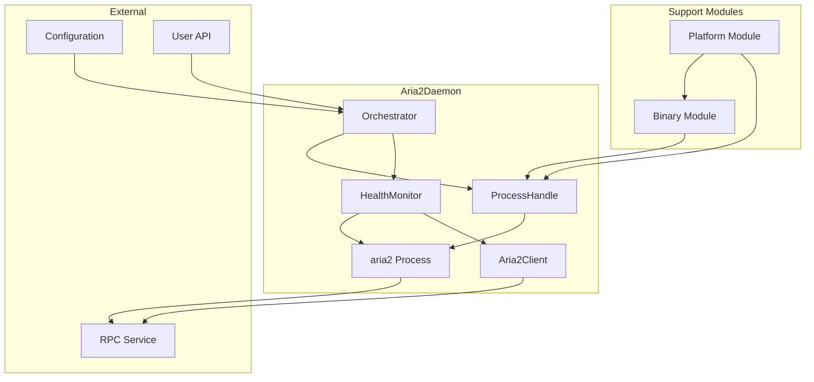

# Orchestrator Module (daemon/orchestrator.rs)

## 概述

`daemon/orchestrator.rs` 模块是整个 aria2 守护进程系统的主协调器，负责统一管理二进制文件、进程控制、健康监控等各个子系统。该模块提供了高级的 API 接口，将复杂的内部逻辑封装为简单易用的外部接口，是整个 daemon 系统的入口点。

## 结构体定义

### DaemonConfig
```rust
#[derive(Clone)]
pub struct DaemonConfig {
    pub rpc_port: u16,
    pub rpc_secret: String,
    pub download_dir: std::path::PathBuf,
    pub session_file: std::path::PathBuf,
    pub max_restart_attempts: u32,
    pub health_check_interval: Duration,
}
```

**作用**: aria2 守护进程的全局配置结构体

**字段详解**:
- `rpc_port: u16` - RPC 服务监听端口
  - 默认值: 6800
  - 范围: 1024-65535（建议使用非特权端口）
  - 用途: aria2 RPC 服务的网络接口

- `rpc_secret: String` - RPC 访问密钥
  - 默认值: "burncloud"
  - 用途: 保护 RPC 接口免受未授权访问
  - 建议: 在生产环境中使用强密码

- `download_dir: PathBuf` - 下载文件存储目录
  - 默认值: 二进制文件所在目录
  - 用途: aria2 下载文件的默认保存位置
  - 要求: 必须具有写入权限

- `session_file: PathBuf` - 会话状态文件路径
  - 默认值: `{binary_dir}/aria2.session`
  - 用途: 保存未完成下载的状态信息
  - 功能: 支持断点续传和重启恢复

- `max_restart_attempts: u32` - 最大重启尝试次数
  - 默认值: 10
  - 用途: 限制自动重启的次数，防止无限循环
  - 范围: 建议 3-50 次

- `health_check_interval: Duration` - 健康检查间隔
  - 默认值: 10 秒
  - 用途: 控制监控器检查进程健康状态的频率
  - 权衡: 更短间隔提供更快故障检测，但消耗更多资源

**设计特点**:
- 实现 `Clone` trait，支持配置在不同组件间传递
- 所有字段都是公共的，提供最大的配置灵活性
- 提供合理的默认值，简化基本使用场景

### Default 实现
```rust
impl Default for DaemonConfig {
    fn default() -> Self {
        let base_dir = platform::get_binary_dir();
        Self {
            rpc_port: 6800,
            rpc_secret: "burncloud".to_string(),
            download_dir: base_dir.clone(),
            session_file: base_dir.join("aria2.session"),
            max_restart_attempts: 10,
            health_check_interval: Duration::from_secs(10),
        }
    }
}
```

**默认配置逻辑**:
- 使用平台特定的基础目录
- 合理的网络和性能参数
- 适合大多数使用场景的设置

**使用示例**:
```rust
// 使用默认配置
let config = DaemonConfig::default();

// 自定义配置
let config = DaemonConfig {
    rpc_port: 8080,
    rpc_secret: "my_secure_secret".to_string(),
    download_dir: PathBuf::from("/custom/downloads"),
    ..Default::default()  // 其他字段使用默认值
};
```

### Aria2Daemon
```rust
pub struct Aria2Daemon {
    process: Arc<process::ProcessHandle>,
    monitor: Arc<monitor::HealthMonitor>,
}
```

**作用**: aria2 守护进程的主控制器

**字段说明**:
- `process: Arc<process::ProcessHandle>` - 进程管理句柄
  - 负责 aria2 进程的启动、停止和状态查询
  - 使用 Arc 支持多线程访问

- `monitor: Arc<monitor::HealthMonitor>` - 健康监控器
  - 提供自动故障检测和恢复功能
  - 在后台持续运行监控任务

**设计优势**:
- 高度模块化的架构
- 清晰的责任分离
- 线程安全的设计

## 核心方法实现

### start
```rust
pub async fn start(config: DaemonConfig, client: Arc<Aria2Client>) -> Result<Self, Aria2Error>
```

**作用**: 启动完整的 aria2 守护进程系统

**参数**:
- `config: DaemonConfig` - 守护进程配置
- `client: Arc<Aria2Client>` - 预配置的 RPC 客户端

**返回值**:
- `Result<Self, Aria2Error>` - 成功返回 Aria2Daemon 实例，失败返回错误

**启动流程详解**:

#### 1. 二进制文件准备
```rust
// 获取二进制文件路径
let binary_path = platform::get_binary_path();

// 检查并下载二进制文件（如果缺失）
if !binary::verify_binary_exists(&binary_path).await {
    binary::download_aria2_binary(&binary_path).await?;
}
```
- 使用平台特定的路径
- 自动下载缺失的二进制文件
- 确保二进制文件可用性

#### 2. 目录准备
```rust
// 确保下载目录存在
platform::ensure_directory(&config.download_dir).await?;
```
- 创建必要的目录结构
- 验证目录权限
- 防止启动时的目录错误

#### 3. 进程配置和启动
```rust
// 创建进程配置
let process_config = process::ProcessConfig {
    rpc_port: config.rpc_port,
    rpc_secret: config.rpc_secret.clone(),
    download_dir: config.download_dir.clone(),
    session_file: config.session_file.clone(),
    max_restart_attempts: config.max_restart_attempts,
};

// 创建并启动进程
let process = Arc::new(process::ProcessHandle::new(binary_path, process_config));
process.start_process().await?;
```
- 转换配置格式
- 创建进程管理器
- 启动 aria2 进程

#### 4. RPC 就绪等待
```rust
// 等待 RPC 服务就绪（最多 30 秒）
let start_time = Instant::now();
let timeout = Duration::from_secs(30);
let mut attempt = 0;

while start_time.elapsed() < timeout {
    attempt += 1;

    if client.get_global_stat().await.is_ok() {
        // RPC 就绪！
        break;
    }

    // 检查超时
    if start_time.elapsed() >= timeout {
        return Err(Aria2Error::DaemonUnavailable(/* ... */));
    }

    // 检查进程状态
    if !process.is_running().await {
        return Err(Aria2Error::ProcessManagementError(/* ... */));
    }

    tokio::time::sleep(Duration::from_millis(500)).await;
}
```

**就绪检查特点**:
- 最大等待时间 30 秒
- 每 500ms 检查一次
- 同时验证进程和 RPC 状态
- 详细的调试信息（Debug 构建）

**调试支持**:
```rust
#[cfg(debug_assertions)]
{
    eprintln!("DEBUG: aria2 process exited during startup on port {}", config.rpc_port);
    eprintln!("DEBUG: Binary path: {:?}", platform::get_binary_path());
    eprintln!("DEBUG: Download dir: {:?}", config.download_dir);
    eprintln!("DEBUG: Session file: {:?}", config.session_file);
    eprintln!("DEBUG: Attempt {} of readiness check", attempt);
}
```

#### 5. 健康监控启动
```rust
// 创建并启动健康监控器
let monitor = Arc::new(monitor::HealthMonitor::new(
    process.clone(),
    client,
    config.health_check_interval,
));
monitor.start();
```
- 使用配置的检查间隔
- 在后台异步运行
- 提供自动故障恢复

**使用示例**:
```rust
use std::sync::Arc;
use crate::daemon::{Aria2Daemon, DaemonConfig};
use crate::client::Aria2Client;

// 创建配置
let config = DaemonConfig::default();

// 创建客户端
let client = Arc::new(Aria2Client::new(
    config.rpc_port,
    config.rpc_secret.clone()
));

// 启动守护进程
match Aria2Daemon::start(config, client).await {
    Ok(daemon) => {
        println!("Aria2 daemon started successfully");
        // 守护进程现在在运行，RPC 可用
    }
    Err(e) => {
        eprintln!("Failed to start daemon: {}", e);
    }
}
```

### stop
```rust
pub async fn stop(&self) -> Result<(), Aria2Error>
```

**作用**: 优雅地停止整个守护进程系统

**返回值**:
- `Result<(), Aria2Error>` - 成功返回 `Ok(())`，失败返回错误

**停止流程**:
1. **停止监控**: 首先停止健康监控器
2. **停止进程**: 然后停止 aria2 进程

**停止顺序的重要性**:
- 先停止监控避免在进程停止时触发重启
- 确保系统的有序关闭
- 防止资源泄漏

**使用示例**:
```rust
// 停止守护进程
match daemon.stop().await {
    Ok(()) => println!("Daemon stopped successfully"),
    Err(e) => eprintln!("Error stopping daemon: {}", e),
}
```

### is_healthy
```rust
pub async fn is_healthy(&self) -> bool
```

**作用**: 检查守护进程是否处于健康状态

**返回值**:
- `bool` - 健康返回 `true`，否则返回 `false`

**健康标准**:
- 目前只检查进程是否在运行
- 未来可扩展为更复杂的健康检查

**使用示例**:
```rust
if daemon.is_healthy().await {
    println!("Daemon is running normally");
} else {
    println!("Daemon is not healthy");
}
```

## Drop 实现

### 自动清理机制
```rust
impl Drop for Aria2Daemon {
    fn drop(&mut self) {
        // 停止监控器
        self.monitor.shutdown();

        // 尝试停止进程
        let process = self.process.clone();

        // 检查运行时环境
        if let Ok(handle) = tokio::runtime::Handle::try_current() {
            // 在新线程中执行异步清理
            let join_handle = std::thread::spawn(move || {
                let _ = handle.block_on(async {
                    let _ = process.stop_process().await;
                });
            });

            // 等待清理完成（最多 100ms）
            let _ = join_handle.join();
        }
        // 如果无法获取运行时句柄，由操作系统清理进程
    }
}
```

**清理策略**:
- 首先停止监控器，防止干扰
- 尝试异步停止进程
- 在新线程中执行，避免运行时冲突
- 如果异步清理失败，依赖操作系统清理

**设计考虑**:
- `Drop` trait 不支持异步操作
- 需要处理不同的运行时环境
- 提供最佳努力的清理机制
- 避免阻塞主线程

## 错误处理

### 启动阶段错误
- `BinaryDownloadFailed` - 二进制文件下载失败
- `ProcessStartFailed` - 进程启动失败
- `DaemonUnavailable` - RPC 服务在超时内未就绪
- `ProcessManagementError` - 进程在启动过程中意外退出

### 运行时错误
- `ProcessManagementError` - 进程管理操作失败
- 网络相关错误 - RPC 通信问题

### 错误恢复
- 健康监控器提供自动故障恢复
- 超过重启限制时停止尝试
- 详细的错误信息便于故障排除

## 系统架构图



## 配置最佳实践

### 开发环境
```rust
let config = DaemonConfig {
    rpc_port: 6800,
    rpc_secret: "dev_secret".to_string(),
    max_restart_attempts: 5,
    health_check_interval: Duration::from_secs(5),
    ..Default::default()
};
```

### 生产环境
```rust
let config = DaemonConfig {
    rpc_port: 16800,  // 非标准端口
    rpc_secret: std::env::var("ARIA2_RPC_SECRET")
        .unwrap_or_else(|_| generate_random_secret()),
    download_dir: PathBuf::from("/var/lib/aria2/downloads"),
    session_file: PathBuf::from("/var/lib/aria2/aria2.session"),
    max_restart_attempts: 20,
    health_check_interval: Duration::from_secs(30),
};
```

### 资源受限环境
```rust
let config = DaemonConfig {
    max_restart_attempts: 3,
    health_check_interval: Duration::from_secs(60),
    ..Default::default()
};
```

## 集成示例

### 基本服务器集成
```rust
use std::sync::Arc;
use tokio::signal;
use crate::daemon::{Aria2Daemon, DaemonConfig};
use crate::client::Aria2Client;

#[tokio::main]
async fn main() -> Result<(), Box<dyn std::error::Error>> {
    // 创建配置
    let config = DaemonConfig::default();

    // 创建客户端
    let client = Arc::new(Aria2Client::new(
        config.rpc_port,
        config.rpc_secret.clone(),
    ));

    // 启动守护进程
    let daemon = Aria2Daemon::start(config, client).await?;

    println!("Aria2 daemon started on port {}", config.rpc_port);

    // 等待终止信号
    signal::ctrl_c().await?;

    // 优雅关闭
    daemon.stop().await?;
    println!("Daemon stopped");

    Ok(())
}
```

### 高可用服务集成
```rust
use std::sync::Arc;
use std::time::Duration;
use tokio::time::{interval, timeout};

pub struct HighAvailabilityService {
    daemon: Option<Aria2Daemon>,
    config: DaemonConfig,
    client: Arc<Aria2Client>,
}

impl HighAvailabilityService {
    pub async fn start(&mut self) -> Result<(), Aria2Error> {
        // 启动守护进程
        let daemon = Aria2Daemon::start(
            self.config.clone(),
            self.client.clone(),
        ).await?;

        self.daemon = Some(daemon);

        // 启动额外的监控任务
        self.start_health_monitoring().await;

        Ok(())
    }

    async fn start_health_monitoring(&self) {
        let client = self.client.clone();
        let config = self.config.clone();

        tokio::spawn(async move {
            let mut interval = interval(Duration::from_secs(30));

            loop {
                interval.tick().await;

                // 高级健康检查
                let health_check = timeout(
                    Duration::from_secs(5),
                    client.get_global_stat()
                ).await;

                if health_check.is_err() {
                    eprintln!("Health check failed, investigating...");
                    // 执行额外的恢复逻辑
                }
            }
        });
    }
}
```

## 依赖关系

### 内部依赖
- `crate::error::Aria2Error` - 错误类型系统
- `crate::client::Aria2Client` - RPC 客户端
- `super::binary` - 二进制文件管理
- `super::process` - 进程管理
- `super::monitor` - 健康监控
- `super::platform` - 平台特定功能

### 外部依赖
- `std::sync::Arc` - 线程安全的引用计数
- `std::time::{Duration, Instant}` - 时间相关操作
- `tokio::time::sleep` - 异步等待

## 设计模式

### 1. 外观模式 (Facade Pattern)
- Orchestrator 为复杂的子系统提供简化接口
- 隐藏内部复杂性，提供高级 API

### 2. 组合模式 (Composition Pattern)
- 将多个独立的组件组合成完整系统
- 每个组件负责特定的功能领域

### 3. 模板方法模式 (Template Method Pattern)
- `start()` 方法定义了启动的标准流程
- 各个步骤可以独立实现和测试

### 4. 策略模式 (Strategy Pattern)
- 通过配置对象实现不同的运行策略
- 支持运行时的行为调整

## 相关模块

- [`binary.rs`](binary.md) - 二进制文件下载和管理
- [`process.rs`](process.md) - aria2 进程生命周期管理
- [`monitor.rs`](monitor.md) - 健康监控和自动恢复
- [`platform.rs`](platform.md) - 平台特定功能抽象